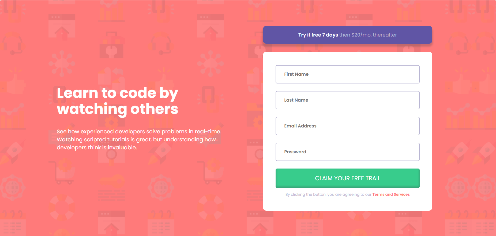
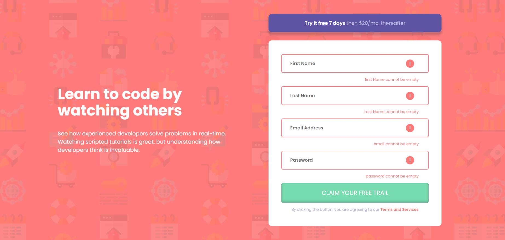
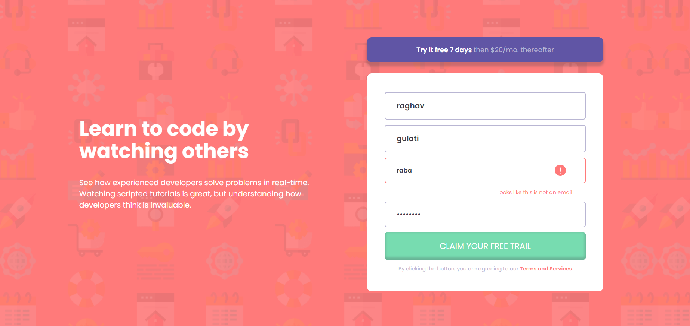
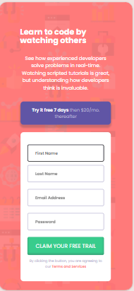
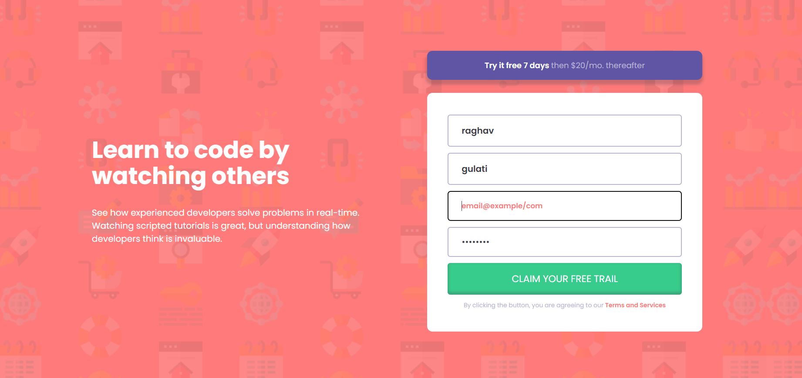

# Frontend Mentor - Social links profile solution

This is a solution to the [Social links profile challenge on Frontend Mentor](https://www.frontendmentor.io/challenges/social-links-profile-UG32l9m6dQ). Frontend Mentor challenges help you improve your coding skills by building realistic projects. 

## Table of contents
  - [Screenshot](#screenshot)
  - [Links](#links)
- [My process](#my-process)
  - [Built with](#built-with)
  - [What I learned](#what-i-learned)
  - [Useful resources](#useful-resources)
- [Author](#author)
- [Acknowledgments](#acknowledgments)

### Screenshot

### Links

- Solution URL: [(https://github.com/Rgulati4657/Intro_component_signup_form)]
- Live Site URL: [(https://intro-component-signup-form-blue.vercel.app/)]

## My process

### Built with

- Semantic HTML5 markup
- CSS custom properties

### what I learned
I learned about like use properties rather to follow someone use it according to own comfort and i learned how to approach when design any layout.

### Useful resources

-This Time i completely made it without using any outer resources.

## Author

- GitHub - [(https://github.com/Rgulati4657)]
- Frontend Mentor - [(https://www.frontendmentor.io/profile/Rgulati4657)]